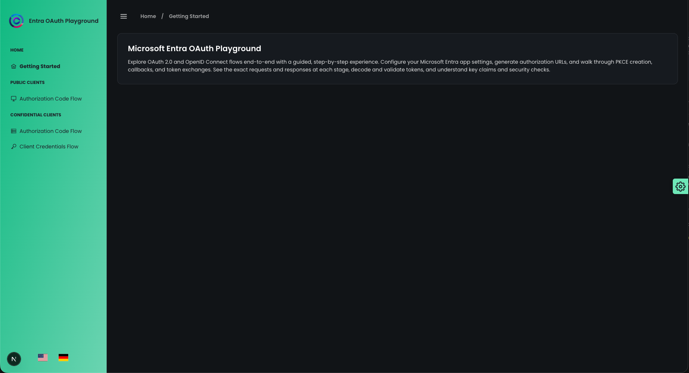
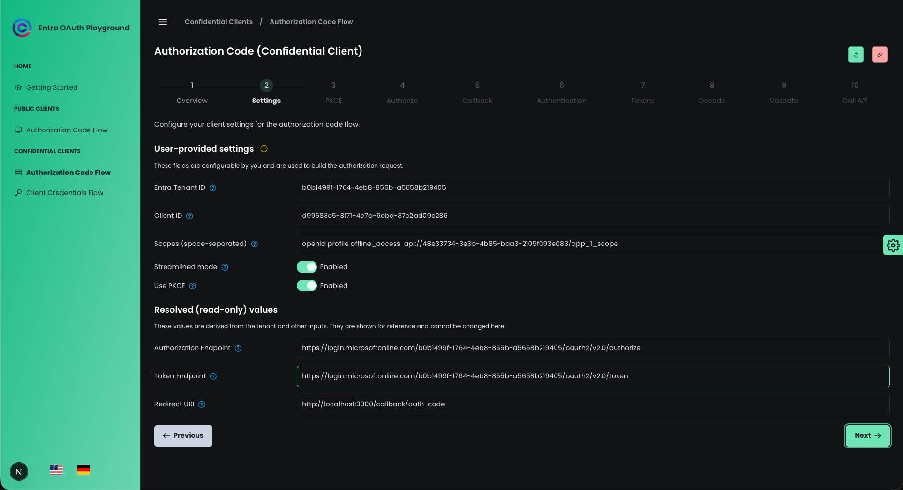
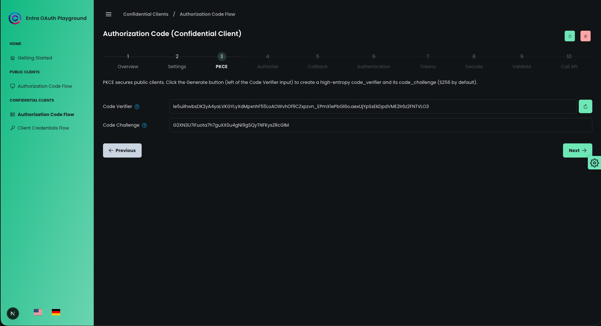
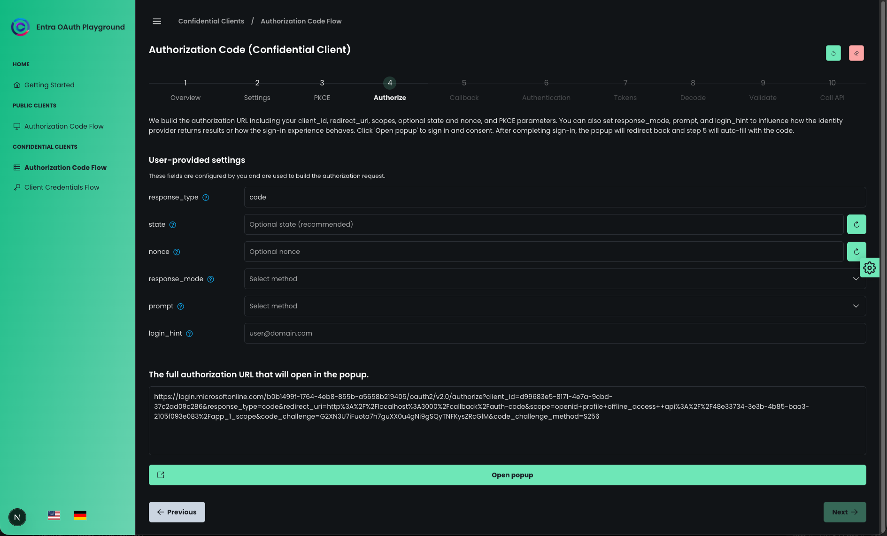
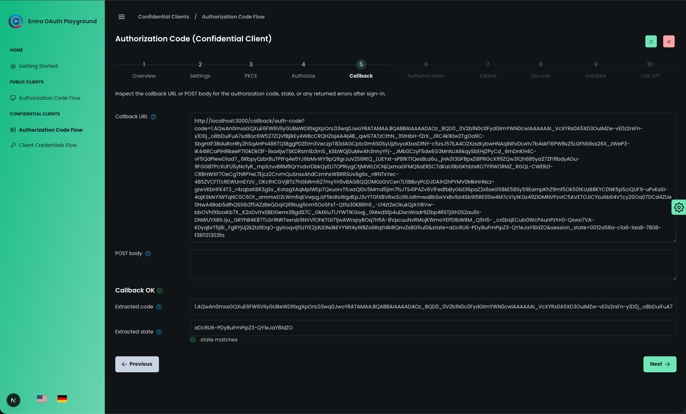
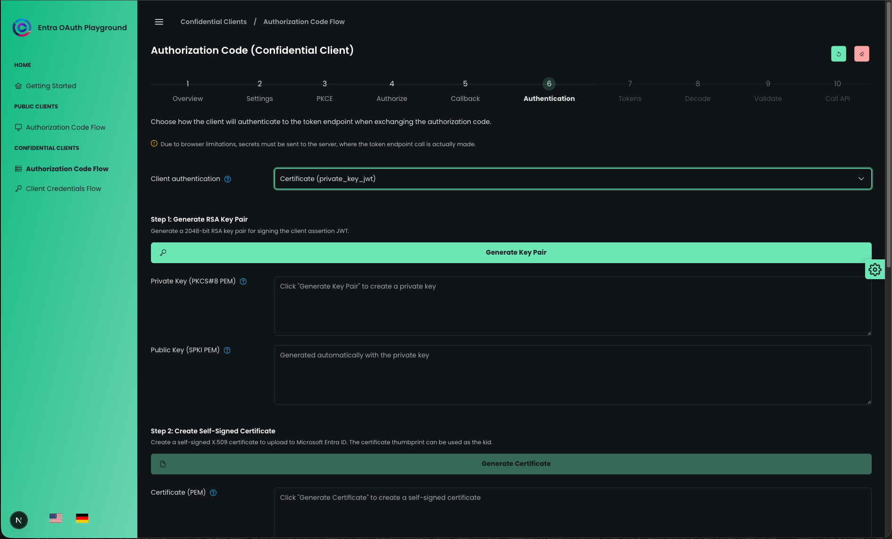
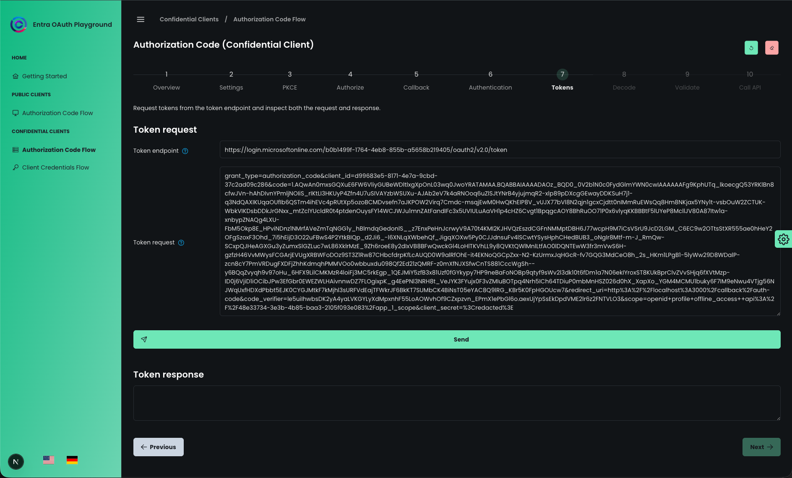
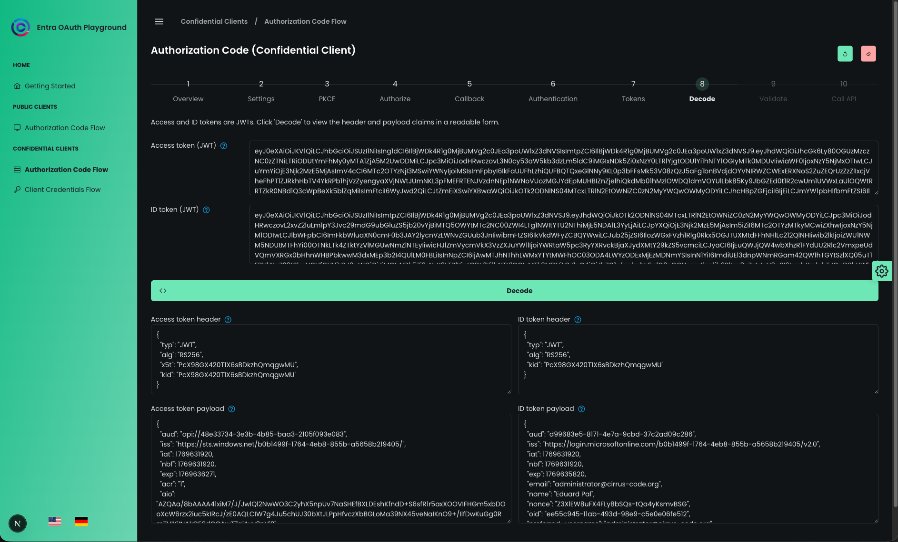
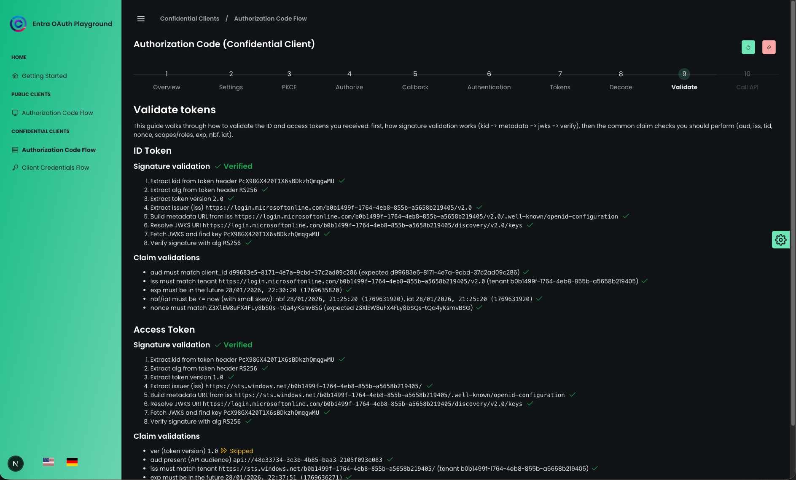
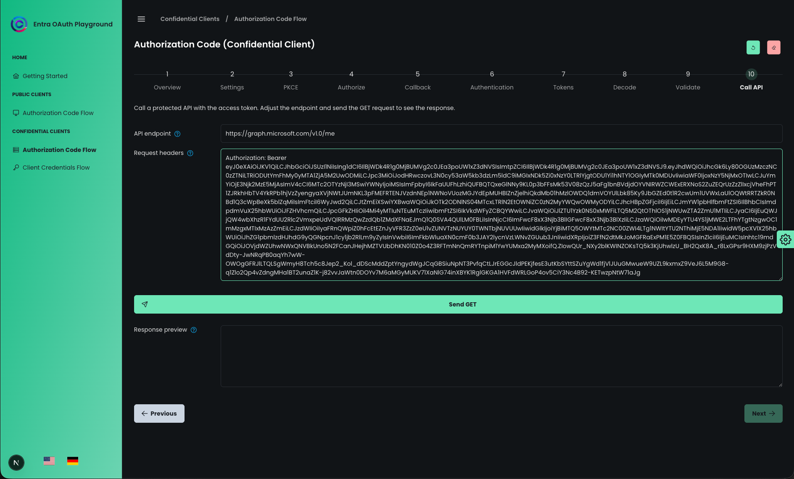

# Next.js Entra ID OAuth Playground

[](https://github.com/edipal/entra-oauth-playground/actions/workflows/github-code-scanning/codeql)

## Disclaimer
This project was created with the assistance of GitHub Copilot. Portions of the code, structure, and documentation were generated and then reviewed/edited by a human. Please validate and test in your environment and review results before relying on them.

This is a proof of concept, not a thoughtfully designed and developed application. It may contain bugs, inefficiencies, and incomplete features.

Ensure appropriate Entra ID security and governance are in place per your organization’s policies.

## Overview
This app helps you explore the most used Microsoft Entra ID OAuth 2.0 flows visually. It breaks down the complex "dance" of modern authentication into discrete, interactive steps.

You can configure your own Entra ID application details, then walk through the process of generating PKCE codes, building authorization URLs, handling callbacks, exchanging codes for tokens, and finally decoding, validating, and testing those tokens.

Supported flows:
- **Authorization Code (Public Client)**
- **Authorization Code (Confidential Client)**
- **Client Credentials (Confidential Client)**

## Confidential client warning - when not running locally
> ⚠️ **Confidential client flows require server-side token exchange.**
>
> Due to browser + Entra ID limitations, secrets (client secrets or private keys used for `client_assertion`) must be sent to a server-side component which performs the token endpoint request and signs assertions when needed. These secrets are used only transiently for the exchange and are not stored by this app (neither in the browser nor on the server).

## Tech stack
- **Framework:** Next.js 15 (App Router, TypeScript)
- **UI Library:** PrimeReact + PrimeFlex + Sass
- **Auth/Crypto:** `jose` (JWT signing/verification)
- **i18n:** `next-intl`
- **Deployment:** Vercel-ready

## Screenshots
Add your own screenshots to replace the placeholders below. Place images in `docs/screenshots/` so they don’t ship with the app.

1. **Landing**

   

2. **Overview**

   

3. **Settings**

   

4. **PKCE** (Authorization Code flows)

   

5. **Authorize** (Authorization Code flows)

   

6. **Callback** (Authorization Code flows)

   

7. **Client Authentication** (Confidential Clients)

   

8. **Token**

   

9. **Decode Tokens**

   

10. **Validate Tokens**

   

11. **Call API / Test Token**

   

## Getting Started

1. **Install dependencies:**
   ```sh
   npm install
   # or
   pnpm install
   ```

2. **Run the development server:**
   ```sh
   npm run dev
   # or
   pnpm dev
   # or
   npm run start # to run independent of next.js dev mode if needed
   ```

3. **Open the app:**
   Visit [http://localhost:3000](http://localhost:3000). The app effectively handles locale redirection (e.g., to `/en`).

4. **Build for production:**
   ```sh
   npm run build
   ```

## Docker image publishing (GitHub Actions)

The workflow [`.github/workflows/docker-publish.yml`](.github/workflows/docker-publish.yml) builds and pushes multi-arch images for:
- `linux/amd64`
- `linux/arm64`

Tag behavior:
- PR merged to `main` publishes `latest`.
- New GitHub Release (tag like `v1.2.3`) publishes `latest`, `v1.2.3`, and `1.2`.

### Required GitHub repository configuration

Add these **Actions secrets** in your repository:
- `DOCKERHUB_TOKEN` (Docker Hub access token, not your password)
- `RELEASE_TOKEN` (GitHub PAT used by release workflow to create commit/tag/release and trigger downstream workflows)

How to create the token in Docker Hub:
1. Go to Docker Hub → **Account Settings** → **Personal access tokens**.
2. Create a token with `Read, Write, Delete` scope (or at least `Read, Write`).
3. Save it as `DOCKERHUB_TOKEN` in GitHub secrets.

### Release recommendation

Yes — even early in the project, using releases is useful.

Use [`.github/workflows/release.yml`](.github/workflows/release.yml):
1. Run **Actions → Release → Run workflow**.
2. Choose bump type (`patch`, `minor`, or `major`).
3. Workflow updates `package.json` (and `pnpm-lock.yaml`), commits, tags, and creates a GitHub Release.
4. The release event triggers Docker publishing workflow automatically.

`RELEASE_TOKEN` should be a GitHub fine-grained PAT with at least:
- Repository access to this repo
- `Contents: Read and write`

## Usage

1. **Register an App:** Go to the [Entra Admin Center](https://entra.microsoft.com/) and register an Application.
2. **Configure Redirect URI:** Add `https://localhost:3000/callback/auth-code` (or your deployed URL). For **public clients**, add it under the **Single-page application** platform; for **confidential clients**, add it under the **Web** platform.
3. **Start the Playground:**
    - Go to **Settings** in the app.
    - Enter your **Client ID** and **Tenant ID**.
    - Select your desired **Scopes**.
4. **Follow the Steps:** Click the "Next" button to progress through the steps.
